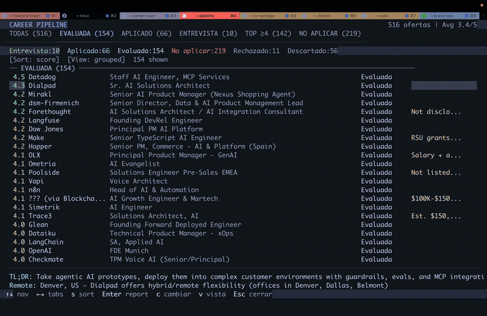
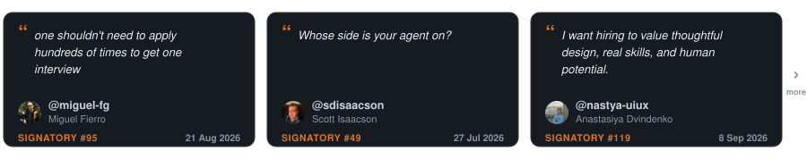

<p align="center"><picture><source media="(prefers-color-scheme: dark)" srcset="docs/wordmark-dark.svg"></picture></p>

<table align="center">
<tr>
<td align="center" valign="middle"><a href="https://github.com/santifer"></a></td>
<td valign="middle">
<strong>Miesiące wysyłania CV w ciszę.</strong> Więc zbudowałem filtr, którego potrzebowałem.<br>
<strong>740 ogłoszeń. 68 aplikacji. 12 rozmów. 1 oferta.</strong><br>
Byłem jego pierwszym użytkownikiem. <strong>Dostałem tę pracę.</strong> Potem otworzyłem kod.
</td>
</tr>
</table>

<div align="center">
<details>
<summary>🌍 Czytaj w 17 językach</summary>
<div align="center">

[English](README.md) | [Español](README.es.md) | [Deutsch](README.de.md) | [Français](README.fr.md) | [Português (Brasil)](README.pt-BR.md) | [한국어](README.ko-KR.md) | [日本語](README.ja.md) | [简体中文](README.cn.md) | [繁體中文](README.zh-TW.md) | [Українська](README.ua.md) | [Русский](README.ru.md) | [Polski](README.pl.md) | [Dansk](README.da.md) | [தமிழ்](README.ta.md) | [العربية](README.ar.md) | [हिन्दी](README.hi.md) | [Türkçe](README.tr.md)

</div>
</details>
</div>

<p align="center">
  Firmy używają AI do filtrowania kandydatów. <strong>Ja dałem kandydatom AI, żeby mogli <em>wybierać</em> firmy.</strong><br>
  Na twoim komputerze mówi ci, które oferty są prawdziwe, które pasują, i <strong>nigdy nie aplikuje w twoim imieniu.</strong>
</p>

<p align="center">
  <a href="https://x.com/santifer/status/2041403685696053741"></a>
</p>

<p align="center"><sub>Ta czerwona zakładka to produkt. <em>Nie aplikuj.</em> <a href="https://santifer.io/career-ops-system">Cała historia →</a></sub></p>

<br>

<p align="center"><a href="HIRED.md"></a></p>

<p align="center">Ludzie, którzy przyszli po mnie, spisali, jak zostali zatrudnieni.</p>

<p align="center">
  <a href="HIRED.md"></a>
</p>

<p align="center"><sub>Każda karta to publiczne issue, które możesz otworzyć. Dostałeś swoją pracę? <a href="https://github.com/career-ops-hq/career-ops/issues/new?template=i-got-hired.yml">Zostaw swoją kartę →</a></sub></p>

<br>

<p align="center">
  <a href="https://wired.com.gr/article/to-ai-ergaleio-pou-fernei-epanastasi-ston-tropo-pou-psachnoume-douleia/" rel="noopener noreferrer nofollow"><picture><source media="(prefers-color-scheme: dark)" srcset="docs/press/wired-dark.svg"></picture></a>
  &nbsp;&nbsp;&nbsp;&nbsp;
  <a href="https://www.businessinsider.com/how-i-built-tool-filter-job-listings-landed-head-ai-2026-4" rel="noopener noreferrer nofollow"><picture><source media="(prefers-color-scheme: dark)" srcset="docs/press/business-insider-dark.svg"></picture></a>
  &nbsp;&nbsp;&nbsp;&nbsp;
  <a href="https://www.producthunt.com/products/santifer-io?utm_source=badge-featured&utm_medium=badge" rel="noopener noreferrer"></a>
  &nbsp;&nbsp;&nbsp;&nbsp;
  <a href="https://trendshift.io/repositories/25195" rel="noopener noreferrer"></a>
</p>

## Twoja kolej

Wklej jedną ofertę, na którą miałeś dziś wieczorem aplikować. Jeśli wróci jako <em>nie aplikuj</em>, właśnie odzyskałeś wieczór. Jeśli wróci z planem, wiesz, co robić dalej.

```bash
npx @santifer/career-ops init
```

<p align="center"><sub>Open source. Lokalnie. W CLI AI, którego już używasz. <a href="docs/RUNNING_ON_A_BUDGET.md">Darmowe i lokalne modele w zestawie.</a></sub></p>


## Nie musisz szukać w pojedynkę

Cisza po kliknięciu „wyślij” nie mówi nic o tobie. Dość ludzi zobaczyło to samo, żeby spisać praktykę w sześciu linijkach:

> Aplikuj lepiej, na mniej ofert. Sygnał zamiast masy. Dowody zamiast słów kluczowych. Decyduje człowiek. Najpierw lokalnie. Godność po obu stronach stołu.

<p align="center"><a href="https://career-ops.org/manifesto?utm_source=readme"></a></p>

<p align="center">Kilkoro z nich, ich własnymi słowami.</p>

<p align="center">
  <a href="https://career-ops.org/manifesto?utm_source=readme"></a>
</p>

<p align="center"><sub>Każdy podpis to commit, który możesz sprawdzić. <a href="https://career-ops.org/manifesto?utm_source=readme">Przeczytaj wszystkie albo dodaj swój →</a></sub></p>

<br>

Rekrutacja sama się nie naprawi. Ludzie, którzy przez nią przechodzą, mogą, i już są w pokoju: porównują notatki i naprawiają sobie nawzajem konfiguracje. [Tu pisze się poprawkę](CONTRIBUTING.md). Pokój, nie klub. **Budujmy razem.**

<p align="center"><a href="https://discord.gg/8pRpHETxa4"></a></p>

## Sponsorzy

career-ops jest darmowy dla kandydatów, na zawsze. Firmy poniżej finansują czas opiekuna projektu i sprawiają, że tak zostaje.

<p align="center">
  <a href="https://serpapi.com/career-ops-org" title="SerpApi"></a>
</p>

<p align="center"><strong>SerpApi</strong> · Build a portfolio project with live search data. SerpApi gives developers structured JSON/Markdown from Google Search, Maps, Shopping, and other engines through a simple API call.</p>

> Sponsoring kupuje wyraźnie oznaczoną widoczność, nigdy wpływ: żadna kwota nie zmienia planu rozwoju ani nie umieszcza niczego w produkcie. Sponsorzy nigdy nie pojawiają się w ocenach, rankingach ani rekomendacjach.

## Co career-ops robi dla ciebie

Wklej ofertę. Powie ci, czy ten wieczór jest tego wart.

- **Fałszywa albo nieaktualna?** Oznacza oferty-widma i oszustwa, zanim napiszesz choć słowo.
- **Nie dla ciebie?** Ocenia rolę względem twojego prawdziwego CV i każe odpuścić słabe dopasowanie. Możesz to nadpisać.
- **Warto?** Przygotowuje szkic CV, listu motywacyjnego i odpowiedzi. Ty je czytasz. Ty je wysyłasz.
- **Z kim rozmawiać?** Znajduje osobę i przygotowuje szkic wiadomości. Nigdy jej nie wysyła.
- **Gdzie to wszystko trafia?** Każda aplikacja zostaje na twoim komputerze. Do nas nic nie jest wysyłane.
- **Czego powinienem się nauczyć?** Po serii odmów nazywa lukę.

Pierwsze uruchomienia są szorstkie. Jeszcze cię nie zna. Porozmawiaj z nim: twoje CV, czego chcesz, czego odmawiasz. Potraktuj to jak pierwszy tydzień rekrutera.

Przy pierwszym uruchomieniu pyta o to wszystko na czacie. Nic do ręcznej konfiguracji.

## Czego career-ops nie robi

- **Automatycznie wysyłać aplikacji.** Przygotowuje szkic odpowiedzi do każdego pola; ty sprawdzasz i klikasz Wyślij. Skrypt nigdy nie wykonuje POST (`prepare-application.mjs`).
- **Nie wysyła maili.** Tylko szkice. W całym kodzie nie ma żadnego transportu poczty.
- **Nie dzwoni do domu.** Bez telemetrii, bez naszego backendu. Twoje CV idzie z twojej maszyny do wybranego przez ciebie dostawcy AI i nigdzie indziej. Jedyny publiczny rejestr to to repozytorium: `HIRED.md` i jego issues.
- **Nie namawia do aplikowania poniżej 4.0/5.** Powie, żeby tego nie robić. Możesz to zignorować, a on to powie.

Przeredagowuje twoje CV; nigdy nie wolno mu go zmyślać. Dziś ta zasada żyje w promptach, jeszcze nie w wymuszającej kontroli w kodzie. Czytaj każde CV przed wysłaniem. Szczegóły w [FAQ](#faq).

## Funkcje

| Funkcja                  | Opis                                                                                                                                     |
| ------------------------ | ---------------------------------------------------------------------------------------------------------------------------------------- |
| **Ocena A-H**            | Podsumowanie roli, dopasowanie CV (z wagą każdego wymagania dla tego ogłoszenia i informacją, czy waga pochodzi z treści opisu, jego struktury czy z szacunku; oznaczone per wymaganie, a szacunek nigdy nie może być w najwyższym paśmie), strategia poziomu, research wynagrodzeń, personalizacja, przygotowanie do rozmowy (STAR+R), plus kontrola wiarygodności ogłoszenia w bloku G, która oznacza oszustwa i martwe oferty, oraz sygnał pozwolenia na pracę, który oznacza opis z wyraźnym brakiem sponsoringu wizy jako twardy bloker |
| **Human-in-the-Loop**    | AI ocenia i rekomenduje, ty decydujesz i działasz. System nigdy nie wysyła aplikacji: ostatnie słowo zawsze należy do ciebie <!-- hitl: absolute guarantee. Do not add "automatically", "by itself", "without your permission" or any other hedge when translating this row. -->               |
| **Generowanie PDF pod ATS** | CV z wstrzykniętymi słowami kluczowymi w designie Space Grotesk + DM Sans                                                             |
| **Generator listów motywacyjnych** | Listy oparte na researchu z odbiciem słów kluczowych, czterema interaktywnymi pytaniami o kąt (dlaczego/problemy/podejście/ton), zatwierdzaniem szkicu w czacie i PDF A4 przez ten sam pipeline HTML + Playwright co CV. Tworzy szkic przy każdej ocenie; dokończ i wygeneruj na żądanie przez `/career-ops cover` |
| **Poza CV**              | Research firmy ([`deep`](modes/deep.md)) odsłania strategię AI, ostatnie ruchy, kulturę inżynierską i kąt, jaki powinien przyjąć twój profil. Wyszukiwanie kontaktów ([`contacto`](modes/contacto.md)) wskazuje hiring managera, rekrutera lub członka zespołu, do którego warto napisać, i tworzy szkic wiadomości na LinkedIn do 300 znaków dopasowanej do typu kontaktu. Szkice formalnych maili aplikacyjnych ([`email`](modes/email.md)) zamieniają oceniony raport lub wklejony opis w temat, treść i checklistę załączników bez wysyłania, składania ani klikania czegokolwiek. Aplikacja ustawia cię w kolejce; research daje ci rozmowę. |
| **Analiza wzorców**      | Wzorce odrzuceń i wskaźniki przejścia per kanał ATS (`analyze-patterns.mjs`), statystyki lejka z całego poszukiwania (`stats.mjs`), wykrywanie ponownych publikacji i martwych ofert (`detect-reposts.mjs`) |

<details>
<summary><b>Wszystko inne, co robi</b></summary>

| Funkcja                  | Opis                                                                                                                                     |
| ------------------------ | ---------------------------------------------------------------------------------------------------------------------------------------- |
| **Auto-Pipeline**        | Wklej URL, dostań pełną ocenę + PDF + wpis w trackerze                                                                                   |
| **Bank historii na rozmowy** | Gromadzi historie STAR+Refleksja między ocenami: 5-10 głównych historii, które odpowiadają na każde pytanie behawioralne               |
| **Skrypty negocjacyjne** | Frameworki negocjacji wynagrodzenia, odpowiedź na obniżkę geograficzną, wykorzystanie konkurencyjnych ofert                              |
| **Szkice maili aplikacyjnych** | Formalne maile do rekrutera, z polecenia lub na zimno z raportu albo wklejonego opisu, z tematem, checklistą załączników, udokumentowanymi punktami dopasowania i blokiem kontaktowym z profilu. Tylko szkice: career-ops nigdy nie wysyła, nie składa i nie klika niczego. |
| **Skaner portali**       | 100+ wstępnie skonfigurowanych firm (Anthropic, OpenAI, ElevenLabs, Retool, n8n...) + własne zapytania po Ashby, Greenhouse, Lever, Wellfound |
| **Odkrywanie firm po finansowaniu** | Komenda `company:funded` (najpierw przegląd) pokazuje firmy z niedawnym finansowaniem i diagnostykę źródeł z ustrukturyzowanych publicznych feedów, bez edytowania twoich danych |
| **Przetwarzanie wsadowe** | Równoległa ocena przez headless workery CLI (`claude -p` / `opencode run`)                                                             |
| **Dashboard TUI**        | Interfejs terminalowy do przeglądania, filtrowania i sortowania pipeline'u                                                               |
| **Integralność pipeline'u** | Automatyczne scalanie, deduplikacja, normalizacja statusów, kontrole stanu                                                            |
| **Zestaw do rozmów**     | Plany przygotowań w blokach czasowych, sesje ćwiczeniowe z feedbackiem, podsumowania po rozmowie ([`interview/`](modes/interview/README.md)) i detektor sygnałów ostrzegawczych firmy ([`interview-redflag`](modes/interview-redflag.md)) |
| **Etap oferty**          | Towarzysz czytania umowy: przejście po klauzulach plus lista pytań do prawnika ([`offer-prep`](modes/offer-prep.md)), i analizator luki między wynagrodzeniem oczekiwanym, ogłoszonym i rzeczywistym (`salary-gap.mjs`) |
| **Follow-upy i odpowiedzi** | Kalkulator rytmu follow-upów i przygotowane przypomnienia (`followup-cadence.mjs`, `followup-seed.mjs`); klasyfikacja odpowiedzi pracodawcy na aktualizacje trackera ([`reply-watch`](modes/reply-watch.md)) |
| **System wtyczek**       | Opcjonalne integracje (Gmail, Notion, Apify + rejestr społeczności), domyślnie wyłączone; zobacz [docs/PLUGINS.md](docs/PLUGINS.md)       |

</details>

## Szybki start

**Najszybsza droga: jedna komenda:**

```bash
npx @santifer/career-ops init
```

> 💡 `npx` jest dostarczany z [Node.js](https://nodejs.org): uruchamia instalator raz,
> nie instalując niczego globalnie. Nie masz jeszcze Node? Zainstaluj go najpierw.
> (Używasz już CLI Claude Code / Gemini / Codex? To już go masz.)

To klonuje najnowsze wydanie do `./career-ops` i instaluje zależności. Potem:

```bash
cd career-ops
claude   # or codex / qwen / opencode / agy / grok — open your AI CLI here
```

**Przy pierwszym uruchomieniu career-ops przeprowadza cię przez konfigurację (twoje CV, profil i docelowe role) po prostu w rozmowie. Nic do edytowania ręcznie.**

<details>
<summary><b>Wolisz skonfigurować ręcznie? (git clone)</b></summary>

```bash
git clone https://github.com/career-ops-hq/career-ops.git
cd career-ops && npm install
npx playwright install chromium   # only needed for PDF generation

# 2. Check setup
npm run doctor                     # Validates all prerequisites

# 3. Configure
cp config/profile.example.yml config/profile.yml  # Edit with your details
cp templates/portals.example.yml portals.yml       # Customize companies

# 4. Add your CV
# Create cv.md in the project root with your CV in markdown

# 5. Open your AI CLI in this directory
claude   # or codex / opencode / qwen / agy / grok

# Then ask your CLI to adapt the system to you:
# "Change the archetypes to backend engineering roles"
# "Translate the modes to English"
# "Add these 5 companies to portals.yml"
# "Update my profile with this CV I'm pasting"

# 6. Start using
# Paste a job URL or JD text to trigger auto-pipeline
# If your CLI supports slash commands, use /career-ops (or its CLI-specific alias)
# In Codex, ask for the same mode in plain language, e.g.:
# "Run the career-ops scan mode"
# "Run the career-ops pipeline mode for data/pipeline.md"
# "Run the career-ops pdf mode for the latest evaluated role"
# "Run the career-ops tracker mode and summarize the current statuses"
```

</details>

### Instalacja globalna

```bash
npm i -g @santifer/career-ops
```

To instaluje binarkę `career-ops` globalnie, więc możesz ją uruchamiać bezpośrednio zamiast przez `npx`. W odróżnieniu od `npx @santifer/career-ops init` (który tworzy katalog projektu), instalacja globalna daje ci stałą komendę `career-ops` dostępną wszędzie w terminalu.

**Której użyć?**
- `npx @santifer/career-ops init`: najlepsza na pierwszy raz; tworzy dedykowany folder projektu.
- `npm i -g @santifer/career-ops`: najlepsza, gdy masz już folder projektu i chcesz uruchamiać komendy career-ops bezpośrednio.

> **System jest zaprojektowany tak, by dostosowywało go samo twoje AI CLI.** Tryby, archetypy, wagi oceny, skrypty negocjacyjne: po prostu poproś, żeby je zmieniło. Czyta te same pliki, których używa, więc wie dokładnie, co edytować.

Zobacz [docs/SETUP.md](docs/SETUP.md) po pełny przewodnik konfiguracji, [docs/RUNNING_ON_A_BUDGET.md](docs/RUNNING_ON_A_BUDGET.md) po instrukcje taniego uruchamiania career-ops na własnych lub lokalnych modelach (i [docs/FREE_TIER.md](docs/FREE_TIER.md), by uruchomić go za darmo na darmowym planie Antigravity CLI), [docs/AUTOMATION.md](docs/AUTOMATION.md) po harmonogram cyklicznych skanów i przepis na selekcję do shortlisty bez tokenów, [docs/APPLY_AUTOFILL.md](docs/APPLY_AUTOFILL.md) po szczegóły autouzupełniania formularzy ATS, [docs/LINKEDIN_JOIN.md](docs/LINKEDIN_JOIN.md) po porównanie eksportu kontaktów z LinkedIn z firmami w twoim lejku, oraz [docs/FAQ.md](docs/FAQ.md) po odpowiedzi na częste pytania o konfigurację, w tym [jak pochodzenie historii zapobiega zmyślonym liczbom](docs/FAQ.md#why-does-career-ops-refuse-to-use-a-number-from-my-story-bank). Zasady projektowe są w [ARCHITECTURE.md](ARCHITECTURE.md); przepływy runtime w [docs/ARCHITECTURE.md](docs/ARCHITECTURE.md).

## Użycie

career-ops używa wspólnego routera komend. W CLI, które rejestrują komendy slash, wygląda to tak:

```
/career-ops           → Pokaż wszystkie dostępne komendy
/career-ops {JD}      → AUTO-PIPELINE: ocena + raport + PDF + tracker (wklej tekst lub URL)
/career-ops pipeline  → Przetwórz oczekujące URL-e ze skrzynki (data/pipeline.md)
/career-ops oferta    → Sama ocena, bloki A–H (bez automatycznego PDF)
/career-ops ofertas   → Porównaj i uszereguj wiele ofert
/career-ops contacto  → Mocny ruch na LinkedIn: znajdź kontakty + napisz szkic wiadomości
/career-ops deep      → Prompt do głębokiego researchu firmy
/career-ops interview-prep → Wygeneruj dokument przygotowania do rozmowy pod konkretną firmę
/career-ops interview    → Interaktywny wywiad wdrożeniowy o profilu i CV
/career-ops eu-swe    → Skalibruj europejską aplikację SWE przed CV, aplikacją lub rozmową
/career-ops eu-fintech → Przeskanuj 21 europejskich portali fintech pod role Product Managera (bez tokenów)
/career-ops interview/plan → Plan przygotowań w blokach czasowych na nadchodzącą rozmowę
/career-ops interview/practice → Rozmowa ćwiczeniowa, jedno pytanie na raz z feedbackiem
/career-ops interview/debrief → Podsumowanie po rozmowie: zamknij luki, przewidź następną rundę
/career-ops interview-redflag → Przeanalizuj sygnały ostrzegawcze pracodawcy przed dołączeniem do firmy
/career-ops pdf       → Tylko PDF, CV zoptymalizowane pod ATS
/career-ops text      → Dopasowane CV w markdown (odzwierciedla cv.md, bez PDF)
/career-ops latex     → Eksportuj CV jako LaTeX/Overleaf .tex
/career-ops latex-tex → Dopasuj własny resume.tex w miejscu (opt-in; cv.md pozostaje domyślne)
/career-ops cover     → List motywacyjny: samodzielnie wklejony opis lub /career-ops cover {slug}
/career-ops email     → Szkic formalnego maila aplikacyjnego (tylko szkic; nigdy nie wysyła, nie składa ani nie klika)
/career-ops add       → Dodaj projekt/publikację/rolę do CV (pobierz + podgląd + potwierdź)
/career-ops expand    → Automatycznie odkryj i dodaj brakujące kompetencje z linków w profilu
/career-ops training  → Oceń kurs/certyfikat względem North Star
/career-ops project   → Oceń pomysł na projekt do portfolio
/career-ops tracker   → Przegląd statusów aplikacji
/career-ops agent-inbox → Kolejkuj/opróżnij żądania na następną sesję (data/agent-inbox.md)
/career-ops apply     → Asystent aplikowania na żywo (czyta formularz + generuje odpowiedzi)
/career-ops scan      → Skanuj portale i odkrywaj nowe oferty
/career-ops discover  → Zamień listę firm na skanowalne tablice ATS + dopisz do portals.yml (bez tokenów)
/career-ops batch     → Przetwarzanie wsadowe z równoległymi workerami
/career-ops patterns  → Analizuj wzorce odrzuceń i popraw celowanie
/career-ops offer-prep → Przeczytaj otrzymaną ofertę/umowę z kandydatem: przejście po klauzulach + pytania do prawnika (to nie porada prawna)
/career-ops titles    → Zaproponuj pokrewne tytuły stanowisk z twojego CV, by poszerzyć poszukiwania
/career-ops upskill   → Zbiorcza analiza luk kompetencyjnych z ocenionych raportów
/career-ops followup  → Tracker rytmu follow-upów: oznacz zaległe, wygeneruj szkice
/career-ops reply-watch → Klasyfikuj odpowiedzi pracodawców i sugeruj aktualizacje trackera
/career-ops outcome   → Zapisz wynik aplikacji i zarchiwizuj artefakty
/career-ops calibrate → Raport doradczy: czy twoje oceny przewidują prawdziwe wyniki? Czyta dane /outcome; nigdy nie zmienia oceniania
/career-ops update    → Zaktualizuj pliki systemowe career-ops z podglądem diff + kontrolą zgodności
```

Albo po prostu wklej URL lub opis oferty: career-ops wykryje go automatycznie i uruchomi pełny pipeline.

W Codex komendy slash nie są gwarantowane. Użyj zamiast tego tych samych nazw trybów w promptcie albo wywołaj je z `codex exec`.

## Jak to działa

```
You paste a job URL or description
        │
        ▼
┌──────────────────┐
│  Archetype       │  Classifies: LLMOps / Agentic / PM / SA / FDE / Transformation
│  Detection       │
└────────┬─────────┘
         │
┌────────▼─────────┐
│  A-H Evaluation  │  Match, gaps, comp research, STAR stories, legitimacy
│  (reads cv.md)   │
└────────┬─────────┘
         │
    ┌────┼────┐
    ▼    ▼    ▼
 Report  PDF  Tracker
  .md   .pdf  entry
```

## Integracja z Antigravity CLI

career-ops wspiera Antigravity CLI natywnie, tak samo jak Claude Code i OpenCode. Wszystkie komendy slash są dostępne przez wspólny punkt wejścia skilla, z tą samą logiką oceny z `modes/*.md`.

Google przeniósł konsumencki dostęp do Gemini CLI na Antigravity CLI. `GEMINI.md` jest teraz nieaktywną osłoną zgodności, żeby Antigravity nie duplikował pełnych instrukcji projektu, gdy czyta zarówno `AGENTS.md`, jak i `GEMINI.md`.

### Natywne Antigravity CLI

```bash
# 1. Run in the career-ops directory
cd career-ops
agy

# 2. Use the unified /career-ops command with subcommands:
/career-ops "Senior AI Engineer at Anthropic..."
/career-ops pipeline
/career-ops scan
/career-ops pdf
/career-ops tracker
```

Skill jest zdefiniowany według otwartego standardu w `.agents/skills/career-ops/SKILL.md` i podlinkowany lub wskazany dla każdego wspieranego CLI (np. `.claude/`, `.cursor/`, `.qwen/`, `.antigravitycli/`, `.grok/`).

## Integracja z Codex

career-ops wspiera Codex przez ten sam wspólny router, ale model wywołania różni się od CLI, które automatycznie rejestrują komendy slash. Pełny przewodnik: [docs/CODEX.md](docs/CODEX.md).

### Interaktywny Codex

```bash
cd career-ops
codex
```

Komendy slash nie są gwarantowane w Codex. Jeśli `/career-ops` jest niedostępne, poproś Codex o uruchomienie trybu bezpośrednio, prostym językiem:

```text
Evaluate this JD with career-ops auto-pipeline: https://company.com/jobs/123
Run the career-ops scan mode and summarize new matches.
Run the career-ops pipeline mode for data/pipeline.md.
Run the career-ops pdf mode for the latest evaluated role.
Run the career-ops tracker mode and summarize the current statuses.
```

### Codex jednorazowo (`codex exec`)

```bash
codex exec "Evaluate this JD with career-ops auto-pipeline: https://company.com/jobs/123"
codex exec "Run career-ops scan mode in this repo and summarize new matches."
codex exec "Run career-ops pipeline mode for data/pipeline.md."
codex exec "Run career-ops pdf mode for the latest evaluated role."
codex exec "Run career-ops tracker mode and summarize the current statuses."
```

## Integracja z Grok Build CLI

career-ops wspiera Grok Build CLI natywnie, tak samo jak Claude Code i OpenCode. `AGENTS.md` jest ładowany automatycznie jako reguły projektu, a wszystkie komendy slash są dostępne przez wspólny punkt wejścia skilla.

### Natywne Grok Build CLI

```bash
# 1. Run in the career-ops directory
cd career-ops
grok

# 2. Use the unified /career-ops command with subcommands:
/career-ops "Senior AI Engineer at Anthropic..."
/career-ops pipeline
/career-ops scan
/career-ops pdf
/career-ops tracker
```

Do headless workerów wsadowych użyj `grok -p "prompt"` (dodaj `--yolo`, by automatycznie zatwierdzać wykonania narzędzi).

### Samodzielny skrypt Gemini API (bez instalacji CLI)

```bash
# 1. Get a free API key at https://aistudio.google.com/apikey
cp .env.example .env
# Edit .env, set GEMINI_API_KEY=your_key_here

# 2. Install dependencies
npm install

# 3. Evaluate a job description
node gemini-eval.mjs "We are looking for a Senior AI Engineer..."
node gemini-eval.mjs --file ./jds/my-job.txt
node agent-inbox.mjs add "..."   # queue a request for the next session
npm run gemini:eval -- "JD text here"
```

> **Darmowy plan:** obie opcje działają bez rozliczeń. Natywne CLI używa Google OAuth; skrypt API używa `gemini-3.6-flash` (limity zapytań zależą od modelu i planu; aktualne kwoty w dokumentacji Google AI).

## Skonfigurowane portale

Skaner ma **100+ firm** gotowych do skanowania i **45+ zapytań wyszukiwania** po głównych portalach z ofertami. Skopiuj `templates/portals.example.yml` do `portals.yml` i dodaj własne:

**Laboratoria AI:** Anthropic, OpenAI, Mistral, Cohere, LangChain, Pinecone
**Voice AI:** ElevenLabs, PolyAI, Parloa, Hume AI, Deepgram, Vapi, Bland AI
**Platformy AI:** Retool, Airtable, Vercel, Temporal, Glean, Arize AI
**Contact center:** Ada, LivePerson, Sierra, Decagon, Talkdesk, Genesys
**Enterprise:** Salesforce, Twilio, Gong, Dialpad
**LLMOps:** Langfuse, Weights & Biases, Lindy, Cognigy, Speechmatics
**Automatyzacja:** n8n, Zapier, Make.com
**Europa:** Factorial, Attio, Tinybird, Clarity AI, Travelperk

**Przeszukiwane portale:** 55+ modułów dostawców obejmuje API ATS, feedy całych portali, feedy XML/RSS, feedy markdown i lokalne parsery. Pełna tabela: [Obsługiwane portale](docs/SUPPORTED_JOB_BOARDS.md).

Domyślnie `node scan.mjs` (czyli `npm run scan`) ufa temu, co zwraca każdy feed ATS. Niektóre firmy zostawiają nieaktualne ogłoszenia w publicznym API nawet po zamknięciu rekrutacji, więc te wygasłe wpisy mogą przeciec do `pipeline.md`. Przekaż `--verify`, by po przejściu API uruchomić Playwrighta i odrzucić wygasłe ogłoszenia, zanim trafią do pipeline'u:

```bash
node scan.mjs --verify          # zero-token discovery + Playwright liveness check
```

Weryfikacja jest sekwencyjna i dotyczy tylko nowych ofert (po deduplikacji), więc koszt pozostaje ograniczony.

### 🇵🇱 Polskie portale z ofertami pracy

career-ops obsługuje główne polskie portale IT. Dwa z nich — JustJoin.it i NoFluffJobs — mają publiczne API i mogą być zintegrowane jako źródła Level 0 (zero tokenów, brak WebSearch, świeże dane w czasie skanowania). Pozostałe portale wymagają weryfikacji ręcznej lub przez Playwright.

| Portal              | URL                                          | API        | Uwagi                                                                 |
| ------------------- | -------------------------------------------- | ---------- | --------------------------------------------------------------------- |
| **JustJoin.it**     | [justjoin.it](https://justjoin.it)           | Publiczne  | Największy portal IT w Polsce. JSON API z pełnymi danymi ofert        |
| **NoFluffJobs**     | [nofluffjobs.com](https://nofluffjobs.com)   | Publiczne  | Obowiązkowe widełki wynagrodzenia. Skierowany do seniorów             |
| **pracuj.pl**       | [pracuj.pl](https://pracuj.pl)               | Brak       | Największy ogólny portal. Blokuje boty (403) — weryfikacja ręczna     |
| **BulldogJob**      | [bulldogjob.pl](https://bulldogjob.pl)       | Brak       | IT-focused, oferty z widełkami                                        |
| **inhire.io**       | [inhire.io](https://inhire.io)               | Brak       | Headhunting IT, często oferty nieujawnione publicznie                 |
| **theprotocol.io**  | [theprotocol.io](https://theprotocol.io)     | Brak       | Dawny Rocket Jobs. Transparentne wynagrodzenia                        |
| **solid.jobs**      | [solid.jobs](https://solid.jobs)             | Brak       | Oferty z weryfikacją przez społeczność                                |

#### Polskie realia rynku pracy w ocenach

career-ops uwzględnia specyfikę polskiego rynku pracy przy ocenianiu ofert:

- **Forma zatrudnienia**: UoP (Umowa o pracę) vs B2B (Faktura VAT) vs UZ (Umowa zlecenie) — różnice w kwocie netto, bezpieczeństwie, urlopie i ZUS mają wpływ na ocenę stabilności
- **Wynagrodzenie**: brutto (przed podatkiem i ZUS) kontra netto (na rękę). Różnica bywa znaczna — system uwzględnia ją przy porównywaniu ofert
- **Benefity**: prywatna opieka medyczna (Medicover, LuxMed, Enel-Med), karta sportowa (MultiSport, OK System), Edenred / karta lunchowa, PPK
- **Urlop**: 20 dni przy stażu poniżej 10 lat, 26 dni przy stażu 10 lat i więcej (Kodeks pracy)
- **Praca zdalna**: pełny remote, hybryd (np. 2 dni/tydzień), model biurowy — system ocenia to w kontekście preferencji kandydata
- **Okres próbny**: do 3 miesięcy (6 miesięcy dla stanowisk kierowniczych zgodnie z KP)

## Dashboard TUI

Wbudowany dashboard terminalowy pozwala przeglądać pipeline wizualnie:

```bash
npm run serve:dashboard   # launch the TUI
npm run build:dashboard   # optional: build the standalone binary
```

Funkcje: 6 zakładek filtrów, 4 tryby sortowania, widok zgrupowany/płaski, podglądy ładowane leniwie, zmiany statusu w linii.

Jest też **eksperymentalny interfejs webowy** (alpha, opt-in: nic nie działa, dopóki go nie uruchomisz): zobacz [`web/README.md`](web/README.md).

## Struktura projektu

```
career-ops/
├── AGENTS.md                    # Canonical agent instructions (all CLIs)
├── CLAUDE.md                    # Claude Code wrapper (imports AGENTS.md)
├── CODEX.md                     # Codex wrapper (imports AGENTS.md)
├── OPENCODE.md                  # OpenCode wrapper (imports AGENTS.md)
├── GEMINI.md                    # Legacy no-op guard to avoid Antigravity duplicate context
├── cv.md                        # Your CV (create this)
├── article-digest.md            # Your proof points (optional)
├── config/
│   └── profile.example.yml      # Template for your profile
├── modes/                       # Skill modes
│   ├── _shared.md               # Shared context (customize this)
│   ├── oferta.md                # Single evaluation
│   ├── pdf.md                   # PDF generation
│   ├── cover.md                 # Cover letter generation
│   ├── email.md                 # Formal application email drafts
│   ├── scan.md                  # Portal scanner
│   ├── batch.md                 # Batch processing
│   └── ...
├── templates/
│   ├── cv-template.html         # ATS-optimized CV template
│   ├── portals.example.yml      # Scanner config template
│   └── states.yml               # Canonical statuses
├── batch/
│   ├── batch-prompt.md          # Self-contained worker prompt
│   └── batch-runner.sh          # Orchestrator script
├── dashboard/                   # Go TUI pipeline viewer
├── data/                        # Your tracking data (gitignored)
├── reports/                     # Evaluation reports (gitignored)
├── output/                      # Generated PDFs (gitignored)
├── fonts/                       # Space Grotesk + DM Sans
├── docs/                        # Setup, customization, budget guide, architecture
└── examples/                    # Sample CV, report, proof points
```

## Zewnętrzny katalog danych (opcjonalnie)

Domyślnie dane warstwy użytkownika (takie jak `cv.md`, `portals.yml` oraz foldery `data/`, `reports/`, `output/`) żyją w folderze głównym projektu.

Aby oddzielić dane osobiste od kodu (łatwiej przełączać gałęzie, pobierać aktualizacje lub testować kilka profili), możesz skonfigurować zewnętrzny katalog danych według następującego pierwszeństwa:

1. **Zmienne środowiskowe:** ustaw zmienną `CAREER_OPS_ROOT` lub `CAREER_OPS_DATA_DIR`:
   ```bash
   export CAREER_OPS_ROOT=~/my-career-data
   ```
2. **Plik znacznika:** utwórz plik `.career-ops-data` w katalogu głównym repozytorium ze ścieżką do katalogu danych.
3. **Domyślnie:** katalog główny repozytorium.

Po rozwiązaniu wszystkie pliki użytkownika są rozwiązywane i zapisywane względem tego folderu, a pliki promptów i skrypty nadal względem repozytorium.

- **Nadpisanie trackera:** możesz też ustawić `CAREER_OPS_TRACKER`, by bezpośrednio wskazać ścieżkę pliku trackera aplikacji.
- **Zapisy:** wszystkie operacje zapisu (np. scalanie) kanonicznie trafiają do `{DATA_ROOT}/data/applications.md`.

Dashboard TUI w Go, skrypty Node.js i tryby agenta AI automatycznie respektują tę hierarchię.


## Stack technologiczny


- **Agent**: AI CLI do kodowania ze wspólnymi skillami i trybami (`AGENTS.md` + wrapper dla CLI)
- **PDF**: Playwright + szablon HTML
- **Listy motywacyjne**: szablon HTML + Playwright (PDF A4, ten sam pipeline co CV)
- **Skaner**: Playwright + Greenhouse API + WebSearch
- **Dashboard**: Go + Bubble Tea + Lipgloss (motyw Catppuccin Mocha)
- **Dane**: tabele Markdown + konfiguracja YAML + pliki wsadowe TSV

<p align="center">
  <a href="https://github.com/career-ops-hq/career-ops/releases/latest"></a>
</p>

<p align="center">
  <a href="https://claude.com/claude-code"></a>
</p>

<p align="center">
  <sub>Działa też w każdym CLI zgodnym ze standardem agent skills. Zobacz <a href="docs/SUPPORTED_CLIS.md">obsługiwane CLI</a>.</sub><br>
  
  
  
  
  
  
  
  
  <br>
  
  
  
  
  
  <a href="TRADEMARK.md"></a>
</p>

## Również open source

- **[cv-santiago](https://github.com/santifer/cv-santiago)**: strona portfolio (santifer.io) z chatbotem AI, dashboardem LLMOps i case studies. Jeśli potrzebujesz portfolio do pokazania przy poszukiwaniu pracy, zforkuj je i zrób swoim.

## FAQ

**Czym jest career-ops?**
career-ops ([career-ops.org](https://career-ops.org), znany też jako **careerops**) to open source'owe wyszukiwanie pracy z AI, które działa lokalnie w twoim AI CLI (Claude Code, Codex, OpenCode i inne) i zostawia każdą decyzję tobie. Ocenia oferty względem twojego CV, generuje PDF-y dopasowane pod ATS, znajduje właściwą osobę do kontaktu i śledzi wszystko w jednym miejscu: ostatnie słowo zawsze należy do ciebie. To pierwsza referencyjna implementacja [Manifestu CareerOps](https://career-ops.org/manifesto).

**Czy dopasowane CV może coś zmyślić?**
Nie wolno mu, i prompty to mówią: przeredagować, nigdy nie zmyślać. Ta zasada nie jest jeszcze wymuszana kontrolą w kodzie. Śledzą to dwa otwarte issues: [#2677](https://github.com/career-ops-hq/career-ops/issues/2677) (nazwy stanowisk muszą zgadzać się z cv.md) i [#1411](https://github.com/career-ops-hq/career-ops/issues/1411) (kontrola wierności blokująca przy niezgodności). Dopóki nie zostaną zmergowane, czytaj każde CV przed wysłaniem. [Zastrzeżenie prawne](LEGAL_DISCLAIMER.md) mówi to samo dłużej.

**Czy mogę uruchamiać career-ops za darmo albo na tańszym / lokalnym modelu?**
Tak. career-ops jest niezależny od CLI i działa na darmowych i lokalnych modelach (darmowe modele OpenRouter, Ollama lub dowolny endpoint zgodny z OpenAI), więc nie jesteś przywiązany do płatnej subskrypcji. Pełna konfiguracja: [docs/RUNNING_ON_A_BUDGET.md](docs/RUNNING_ON_A_BUDGET.md).

**Płacę za Claude Pro/Max, ale career-ops zużywa kredyty API. Dlaczego?**
Bo `ANTHROPIC_API_KEY` w twoim środowisku ma pierwszeństwo przed zalogowaną subskrypcją: CLI używa klucza i rozlicza per token. Uruchom `echo $ANTHROPIC_API_KEY`, a jeśli coś wypisze, usuń go z profilu powłoki, zrestartuj terminal i uruchom `/login`. Tryb wsadowy jest wyjątkiem, bo workery `claude -p` nie używają interaktywnego logowania: uruchom raz `claude setup-token` i wyeksportuj wynik jako `CLAUDE_CODE_OAUTH_TOKEN`. Pełna instrukcja w [docs/RUNNING_ON_A_BUDGET.md](docs/RUNNING_ON_A_BUDGET.md#2b-already-paying-for-a-subscription-make-sure-you-are-using-it).

**Z jakimi AI CLI działa career-ops?**
career-ops działa z każdym głównym AI CLI do kodowania (Claude Code, Codex, Gemini / Antigravity, OpenCode, Grok, Qwen i inne) przez otwarty Agent Skill Standard, więc nigdy nie jest przywiązany do jednego dostawcy. Użyj CLI, które już masz.

**Jak zainstalować career-ops na Windows?**
career-ops działa na Windows. Konfiguracja specyficzna dla platformy i znane pułapki (wykrywanie Git Bash, końce linii, Harmonogram zadań) są w [docs/WINDOWS.md](docs/WINDOWS.md). Jeśli skille nie ładują się z błędem symlinka podczas instalacji, rozwiązanie jest w [docs/FAQ.md](docs/FAQ.md). Pełne kroki w [docs/SETUP.md](docs/SETUP.md).

**Czy career-ops aplikuje na oferty za mnie?**
Nie. career-ops to filtr, a nie narzędzie do masowego automatycznego aplikowania. AI ocenia, szereguje i pisze szkice; ty sprawdzasz i decydujesz. Nigdy nie składa, nie wysyła ani nie klika niczego: ostatnie słowo zawsze należy do ciebie. Właśnie o to chodzi w projekcie z człowiekiem w pętli.

**Czy career-ops jest darmowy i open source?**
Tak. career-ops jest darmowy i open source, i dla kandydata zawsze taki będzie: to pierwsza referencyjna implementacja [Manifestu CareerOps](https://career-ops.org/manifesto). Przeczytaj go, a jeśli mówi to, w co wierzysz, podpisz.

## O autorze

Jestem [Santiago Fernández de Valderrama Aparicio](https://santifer.io/about) (santifer): Head of Applied AI, były założyciel (zbudowałem i sprzedałem firmę, która nadal działa pod moim nazwiskiem). Zbudowałem career-ops, żeby zarządzać własnym poszukiwaniem pracy. Zadziałało: użyłem go, by dostać swoje obecne stanowisko.

Ciekawi cię, jak to repozytorium jest utrzymywane w około 4 godziny tygodniowo? Przeczytaj [Agentic maintenance: how career-ops is run by a fleet of AI agents](https://santifer.io/ai-agent-fleet).

Moje portfolio i inne projekty open source → [santifer.io](https://santifer.io)

Wikidata: [Santiago Fernández de Valderrama Aparicio](https://www.wikidata.org/wiki/Q138710224) · [career-ops](https://www.wikidata.org/wiki/Q139007988).

## Zastrzeżenie prawne

**career-ops to lokalne narzędzie open source, NIE usługa hostowana.** Używając tego oprogramowania, przyjmujesz do wiadomości, że:

1. **Ty kontrolujesz swoje dane.** Twoje CV, dane kontaktowe i dane osobowe zostają na twojej maszynie i są wysyłane bezpośrednio do wybranego przez ciebie dostawcy AI (Anthropic, OpenAI itd.). Nie zbieramy, nie przechowujemy ani nie mamy dostępu do żadnych twoich danych.
2. **Ty kontrolujesz AI.** Domyślne prompty instruują AI, by nie wysyłało aplikacji automatycznie, ale modele AI mogą zachowywać się nieprzewidywalnie. Jeśli modyfikujesz prompty lub używasz innych modeli, robisz to na własne ryzyko. **Zawsze sprawdzaj poprawność treści wygenerowanych przez AI przed wysłaniem.**
3. **Ty przestrzegasz regulaminów stron trzecich.** Musisz używać tego narzędzia zgodnie z regulaminami portali kariery, z którymi wchodzisz w interakcję (Greenhouse, Lever, Workday, LinkedIn itd.). Nie używaj tego narzędzia do spamowania pracodawców ani przeciążania systemów ATS.
4. **Brak gwarancji.** Oceny to rekomendacje, nie prawda. Modele AI mogą halucynować umiejętności lub doświadczenie. Autorzy nie ponoszą odpowiedzialności za wyniki zatrudnienia, odrzucone aplikacje, ograniczenia kont ani żadne inne konsekwencje.

Zobacz [LEGAL_DISCLAIMER.md](LEGAL_DISCLAIMER.md) po pełne szczegóły. To oprogramowanie jest dostarczane na [licencji MIT](LICENSE) „tak jak jest", bez jakiejkolwiek gwarancji.

## Współtwórcy

<a href="https://github.com/career-ops-hq/career-ops/graphs/contributors">
  
</a>

Każda osoba, która dostarczyła kod, dokumentację, tłumaczenia lub testy, jest wymieniona w
[CONTRIBUTORS.md](CONTRIBUTORS.md), łącznie z wkładem niekodowym, którego
powyższy graf nie może pokazać.

Dostałeś pracę dzięki career-ops? [Podziel się swoją historią!](https://github.com/career-ops-hq/career-ops/issues/new?template=i-got-hired.yml)

## Licencja i znak towarowy

Kod jest na licencji [MIT](LICENSE). Nazwa i marka
„career-ops" podlegają [Polityce znaku towarowego](TRADEMARK.md): liberalnej
dla użytku społeczności, zastrzeżonej dla nazewnictwa produktów komercyjnych
i rekomendacji.

## Historia gwiazdek

<p align="center">
  <a href="https://warpchart.dev/hq">
    <picture>
      <source media="(prefers-color-scheme: dark)" srcset="https://warpchart.dev/api/chart?theme=dark&v=3">
      
    </picture>
  </a>
</p>

<p align="center"><sub>Stworzył i utrzymuje <a href="https://santifer.io">Santiago Fernández de Valderrama Aparicio</a> (<a href="https://github.com/santifer">@santifer</a>)</sub></p>

## Bądźmy w kontakcie

[](https://santifer.io)
[](https://linkedin.com/in/santifer)
[](https://x.com/santifer)
[](https://discord.gg/8pRpHETxa4)
[](mailto:hi@santifer.io)
